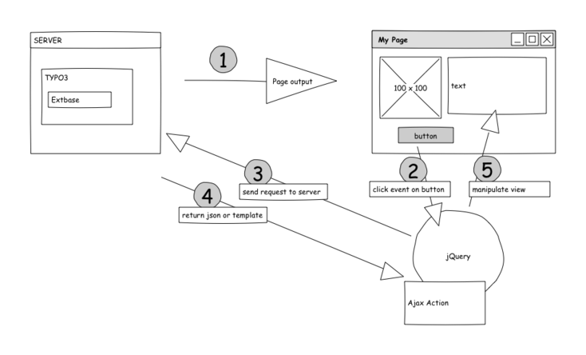

#[Extensionentwicklung](0100%20Index.markdown)#

Mit dem eID Mechanismus und einem separatem PageType stehen zwei unterschiedliche Methoden für AjaxCalls zur Verfügung. 
Beide haben ein ähnliches Funktionsprinzip, unterscheiden sich aber deutlich in Details. Eine Gegenüberstellung.


##Ajax und Extbase: eID oder Page Type nutzen?##

Unabhäng von der Fragestellung eID oder PageType hier einmal das Grundschema eines Ajax Aufrufes. Einsteigern in die Thematik ist oftmals nicht klar, das der Serverresponse in jQuery ausgewertet werden muss. Ohne eine Result-Success-Function, ändert sich auch nichts im Fronend ;)

Die Grundüberlegung von Ajax ist, - unabhängig vom Mechanismus - einen möglichst kleinen Datensatz vom Server zurück zu erhalten den wir dann per jQuery auswerten und den View manipulieren (Punkt 4 + 5) - ganz ohne Seitenreload.

Also keinen Pageheader etc., sondern exakt genau nur die Daten die wir brauchen.

 .

**Gegenüberstellung eID Mechanismus und pageType**

|      | eID | page Type |
|------|-----|-----------|
| Einbindung in Extension | • Dispatcher Class im Controller Verzeichnis<br />• eID include in ext-tables.php | Definition pageType in Extension setup |
| Ajax Aufruf             | Controller, Action, Parameter              | Controller, Action, Parameter <br />+ PageType |
| Rückgabe                | gewöhnlich json String                     | json String oder <br /> html string des gefülleten Teplates  |
| Controller Action Umgebung | kein TSFE geladen                          | TSFE geladen (settings, <br />mapped tables etc stehen zur Verfügung) |
| Beispielanwendung       | • Nachladen von Werten für Select Felder  <br /> • autocomplete Funktionen | • Komplexe Seitenmanipulationen <br /> • ganze Bereiche ersetzten, da gefüllte <br />Templates als html string geliefert |

*Natürlich ist es möglich auch über den eID Mechanismus das komplette TSFE zu laden, nur dann geht mir persönlich irgendwie der Charme gegenüber der PageType Lösung verloren.*


###Fazit###
Auch wenn das jeder etwas anders sieht, für einfache Listen, Autocomplete Funktionen nutze (bisher - siehe Nachtrag eID Version)ich den eID Mechanismus.

Da hier keine TSFE für die Controller Funktion aufgebaut wird, sollte das die schnellere Variante sein. Typische Fehler entstehen dadurch, das die innerhalb der Controlleraction keine settings wie z.B. storagePids bekannt sind. Entweder die storagePid im Ajax Aufruf als Parameter mitgeben oder die query entsprechend ändern.

Braucht man jedoch umfangreiche Möglichkeiten in der Controller Action, wird man den Aufruf via PageType vorziehen. So hat man unbegrenzten Zugang zu mapped Tables (Fe-User etc) und allen Klassen die injected wurden. Das Ergebnis der aufgerufene ControllerAction kann auch normal an ein Template weitergereicht werden, das dann komplett in jQuery zur Verfügung steht.

###Die Technik: eID Version###

Eine komplette Beschreibung mit Snippets für TYPO3 6.1 findet Ihr hier: Ajax Dispatcher eID in TYPO3 6.1. Ich denke da ist alles ausfühlich beschrieben.

**Nachtrag:** Unter TYPO3 6.2 haben sich die im Dispatcher aufgerufenen Core Funktionen nochmal geändert. Der Bootstrap braucht jetzt weitere Parameter für die Initialisierung (Package Management). Im Core Quellcode ist auch ein endeutiger Hinweis diese Funktion nicht in eigenen Extensions zu benutzten. Da ich im Augenblick nicht absehen kann, was uns das Package Mangement noch alles bringt (die Bootstrap Function braucht das aktuelle Package), kann ich den eID Mechanismus so nicht mehr empfehlen. 


###Die Technik: PageType###

Die Verwendung eines einen page Types für Ajax Calls ist relativ simpel. Das wichtigste ist eine eigene page Num, auf dieser Seite habe ich die Vorgehensweise zusammengefasst:
AjaxCalls mit Page Types

Wie in der oben bereits angemerkt, müsst Ihr euer Extsnionsetup um einen neuen PageType erweitern. Die PageType Nummer muss einmalig in der Installation sein, also ggf. bereits vergebene PageTypes für RSS, Sitemaps, Print & Co beachten. 

````
ajaxCall = PAGE
ajaxCall {
    typeNum = 999
    config.disableAllHeaderCode = 1
    config.metaCharset = UTF-8
    10 = COA
    10 <  styles.content.get
    }
````
    
Mit dieser Einstellung könnt Ihr ganz normale euer Actionergebnis an einen View übergeben den Ihr dann komplett in Ajax zur Verfügung habt.

Der AjaxCall in jQuery sieht dann ungefähr so aus: 

````
$.ajax({
    var controller = tx_myExt_pi1[controller]= blabla;
    var action = tx_myExt_pi1[action]= bub; // ohne Action am Ende
    var pagetype = 999;
    url: './?' + controller + '&' + action + '&type=' + pagetype
    //optionale Parameter
    data: 'useruid=' + useruid,
    success: function(result) {
        console.log(result);
    },
    error: function(error) {
       console.log(error);
    }
});
````
 
 
Innerhalb von success:function(result) { } wird dann das Ergebnis ausgewertet und der View manipuliert.
